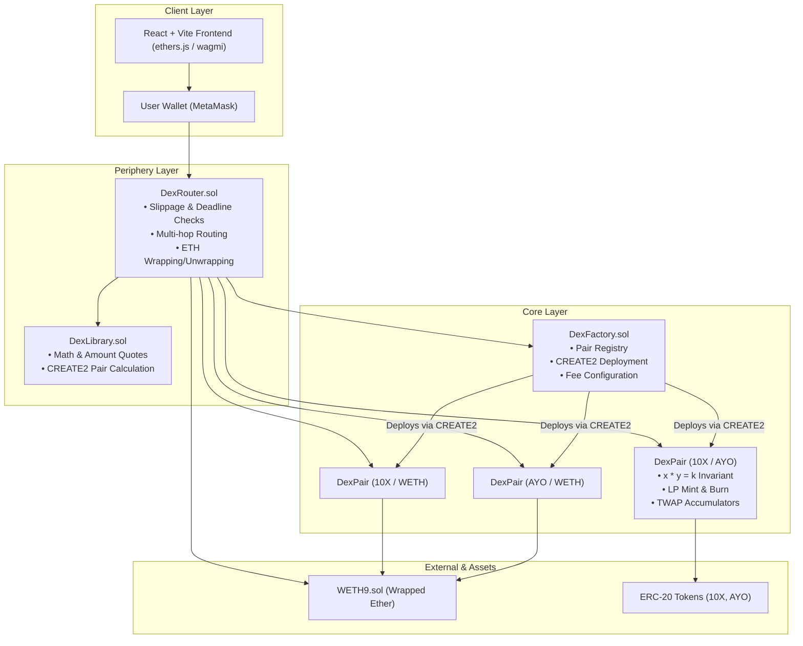

# 10x DEX — Constant Product Automated Market Maker (AMM)

**10x DEX** is a decentralized exchange protocol inspired by Uniswap V2, built from scratch using Solidity and Foundry, paired with a modern glassmorphic React frontend. It implements an Automated Market Maker (AMM) using the constant product invariant ($x \cdot y = k$) to enable automated token swaps, decentralized liquidity pooling, and price discovery on EVM networks.

---

## 🏛️ System Architecture Overview

10x DEX separates logic into **Core** contracts (which manage funds, liquidity reserves, and pool tokens) and **Periphery** contracts (which guard users against slippage, front-running, and expiration, and handle multi-token routing).



---

## 📜 Smart Contracts & How They Work

### 1. `DexFactory.sol` (Core Registry)
- **Role**: Factory contract responsible for deploying and indexing all liquidity pools (`DexPair`).
- **How It Works**:
  - Employs deterministic **`CREATE2`** deployment so that any pair contract address can be computed off-chain or on-chain given the two token addresses, without querying storage.
  - Enforces pool uniqueness: sorts tokens by address (`token0 < token1`) so only one pair can exist per token pair.
  - Manages protocol fee settings (`feeTo` and `feeToSetter`), allowing governance to collect a fraction of the trading fees if activated.
  - Stores an array of all pairs (`allPairs`) and a reverse lookup mapping (`getPair[tokenA][tokenB]`).

### 2. `DexPair.sol` (Liquidity Pool & LP Token)
- **Role**: The core AMM automated market maker pool and ERC-20 Liquidity Provider (LP) token.
- **How It Works**:
  - **Constant Product Formula**: Maintains reserves of two tokens, enforcing $(x \cdot y \ge k)$ on every trade.
  - **Trading & Swaps**: Executes atomic token swaps through `swap(amount0Out, amount1Out, to, data)`. Automatically deducts a **0.3% trading fee** that stays within the pool to reward liquidity providers.
  - **Flash Swaps**: If the `data` parameter in `swap()` is non-empty, the pool hands tokens to the receiver before verifying repayment at the end of the transaction, enabling uncollateralized arbitrage.
  - **LP Token Minting (`mint`)**: When users deposit token pairs, the contract mints proportional LP tokens representing fractional ownership of the reserves. Permanently locks `MINIMUM_LIQUIDITY` (1,000 wei) on initial deposit to prevent division-by-zero share inflation exploits.
  - **LP Token Burning (`burn`)**: Users burn their LP tokens to withdraw their proportional share of the underlying reserves.
  - **TWAP Price Oracles**: Maintains cumulative price accumulators (`price0CumulativeLast`, `price1CumulativeLast`) timestamped each block to support Time-Weighted Average Price oracles resistant to single-block manipulation.
  - **Security**: Guarded by a non-reentrant execution lock modifier (`lock`).

### 3. `DexRouter.sol` (Periphery Safety & Execution Gateway)
- **Role**: User-facing entry point that handles user interactions safely and executes multi-step operations.
- **How It Works**:
  - **Slippage Protection**: Accepts `amountOutMin` and `amountInMax` parameters. If on-chain market movement causes the output to fall below expectations, the transaction reverts.
  - **Deadline Protection**: Accepts a `deadline` unix timestamp; prevents miners or validators from holding transactions in the mempool and executing them under unfavorable market conditions.
  - **Native ETH Support**: Bridges native ETH with wrapped ETH (`WETH9`) seamlessly via `addLiquidityETH`, `removeLiquidityETH`, and `swapExactETHForTokens`.
  - **Multi-Hop Routing**: Swaps tokens across intermediate pools (e.g., Token A $\to$ WETH $\to$ Token B) using path arrays.

### 4. `DexLibrary.sol` (Math Utilities)
- **Role**: Pure Solidity library providing AMM mathematical calculations.
- **How It Works**:
  - Calculates deterministic pair addresses (`pairFor`) using the bytecode hash of `DexPair` without cross-contract calls.
  - Computes exact swap pricing given reserves and fees:
    $$\text{amountOut} = \frac{\text{amountIn} \cdot 997 \cdot \text{reserveOut}}{(\text{reserveIn} \cdot 1000) + (\text{amountIn} \cdot 997)}$$
  - Handles proportional quotes (`quote`) and multi-hop reserve chaining (`getAmountsOut`, `getAmountsIn`).

### 5. `WETH9.sol`
- **Role**: Canonical Wrapped Ether ERC-20 contract. Allows native ETH to be deposited (`deposit()`) into an ERC-20 representation and withdrawn back to ETH (`withdraw()`).

### 6. `MockERC20.sol` (`10X` & `AYO`)
- **Role**: Standard ERC-20 tokens deployed for testing and live testnet demonstrations, with minting capabilities for liquidity seeding.

---

## 📍 Deployed Contract Addresses

### 🌐 Ethereum Sepolia Testnet (Chain ID: `11155111`)

| Contract Name | Symbol | Sepolia Contract Address | Explorer |
| :--- | :--- | :--- | :--- |
| **DexRouter** | — | `0x66f3A66F4019419691B15284AC501c3b73A829D9` | [View on Etherscan](https://sepolia.etherscan.io/address/0x66f3A66F4019419691B15284AC501c3b73A829D9) |
| **DexFactory** | — | `0xBB507A2fD265ADE1Cf56B0430DeEcF92694fFF81` | [View on Etherscan](https://sepolia.etherscan.io/address/0xBB507A2fD265ADE1Cf56B0430DeEcF92694fFF81) |
| **WETH9** | `WETH` | `0xA83A5cc5506039bed4EA969f631b0B736604EB54` | [View on Etherscan](https://sepolia.etherscan.io/address/0xA83A5cc5506039bed4EA969f631b0B736604EB54) |
| **10x Token** | `10X` | `0x967AB6b873862F1C8a3fb40490D2180D8993b137` | [View on Etherscan](https://sepolia.etherscan.io/address/0x967AB6b873862F1C8a3fb40490D2180D8993b137) |
| **Ayo Token** | `AYO` | `0x80FD1e9FF274d13624054790b7b82b5ece297ba9` | [View on Etherscan](https://sepolia.etherscan.io/address/0x80FD1e9FF274d13624054790b7b82b5ece297ba9) |

*Pre-seeded Pools on Sepolia*:
- **`10X / AYO`**: Initialized at a 1:1 ratio (10,000 `10X` + 10,000 `AYO`).
- **`10X / WETH`** and **`AYO / WETH`**: Seeded with testnet ETH liquidity.

---

### ⚡ Local Anvil Node (Chain ID: `31337`)

| Contract Name | Symbol | Local Anvil Address |
| :--- | :--- | :--- |
| **DexRouter** | — | `0x9fE46736679d2D9a65F0992F2272dE9f3c7fa6e0` |
| **DexFactory** | — | `0xe7f1725E7734CE288F8367e1Bb143E90bb3F0512` |
| **WETH9** | `WETH` | `0x5FbDB2315678afecb367f032d93F642f64180aa3` |
| **10x Token** | `10X` | `0xCf7Ed3AccA5a467e9e704C703E8D87F634fB0Fc9` |
| **Ayo Token** | `AYO` | `0xDc64a140Aa3E981100a9becA4E685f962f0cF6C9` |

---

## 🧮 Mathematical Mechanics

### 1. The Constant Product Invariant
The AMM maintains the invariant formula:
$$x \cdot y = k$$
Where:
- $x$ = Pool balance of Token 0.
- $y$ = Pool balance of Token 1.
- $k$ = Invariant constant product (increases monotonically as fees accumulate).

### 2. Swap Pricing with 0.3% Trading Fee
When a trader swaps $\Delta x$ tokens in exchange for $\Delta y$ tokens, a 0.3% fee is deducted from the input amount ($\gamma = 0.997$):
$$(x + 0.997 \cdot \Delta x)(y - \Delta y) \ge x \cdot y$$

Solving for output $\Delta y$:
$$\Delta y = \frac{y \cdot \Delta x \cdot 997}{x \cdot 1000 + \Delta x \cdot 997}$$

### 3. Liquidity Provision (Minting LP Shares)
- **First Deposit**:
  $$S_{\text{minted}} = \sqrt{x_{\text{deposited}} \cdot y_{\text{deposited}}} - 1000$$
  *(1,000 shares are permanently locked to `address(0)` to prevent the first depositor exploit).*
- **Subsequent Deposits**:
  $$S_{\text{minted}} = \min\left(\frac{x_{\text{deposited}}}{x_{\text{reserve}}}, \frac{y_{\text{deposited}}}{y_{\text{reserve}}}\right) \cdot S_{\text{total}}$$

---

## 💻 Frontend Application Overview

The frontend (`frontend/`) is built with **React**, **Vite**, and **ethers.js**:
1. **Network Switcher Control**:
   - Seamlessly toggles between **Sepolia Testnet** (`11155111`) and **Anvil Local** (`31337`).
   - Automatically synchronizes provider instances and prompts MetaMask to switch networks if mismatched.
2. **Swap Interface (`SwapCard.jsx`)**:
   - Live bidirectional quote estimation.
   - Customizable slippage tolerance presets (0.1%, 0.5%, 1.0%, custom).
   - Dynamic token inverting and token balance display.
3. **Liquidity Pool (`PoolCard.jsx`)**:
   - Deposit matching token ratios to earn 0.3% LP fees.
   - Live pool reserve and balance tracking.
4. **Contract Explorer Card (`ContractsInfoCard.jsx`)**:
   - Lists active contract addresses for the selected network.
   - One-click copy and Etherscan redirection.
   - One-click **Add to MetaMask** button for `10X` and `AYO`.

---

## 🛠️ Development & Testing Guide

### 1. Smart Contract Tests
Run the comprehensive Foundry test suite (unit tests, fuzz tests, flash swap tests):
```bash
forge test -vvv
```

### 2. Local Anvil Deployment
```bash
# Terminal 1: Start local node
anvil

# Terminal 2: Deploy contracts and seed local pools
forge script script/DeployLocal.s.sol --rpc-url http://127.0.0.1:8545 --broadcast
```

### 3. Launching the Frontend
```bash
cd frontend
npm install
npm run dev
```
Open **`http://localhost:5173`** in your browser. Connect MetaMask and select **Sepolia Testnet** or **Anvil Local** to start trading!

